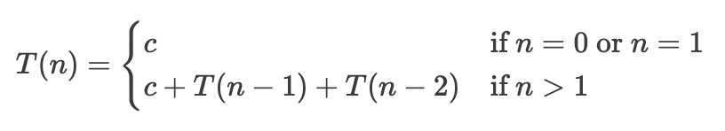
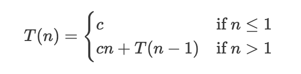
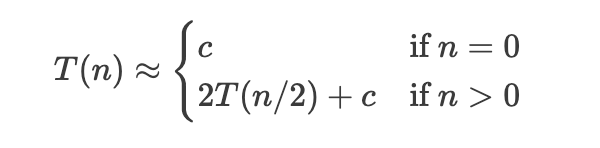
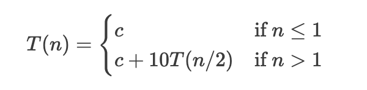
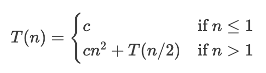
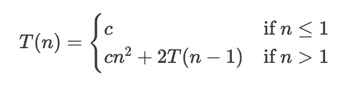
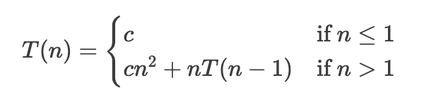

# Recurrence Equations

A _recurrence equation_ defines a function in terms of its value on smaller inputs. Such equations are useful for describing the behavior of _recursive_ algorithms. 

Given a recursive algorithm and a certain aspect of its behavior that we want to analyze (e.g., the number of operations it performs, or the amount of memory it uses), we can express that using a recurrence equation. Solving the recurrence equation then gives us insight into the behavior of the algorithm (e.g., its time complexity or space complexity).

## Example 1

Consider the following recursive implementation of binary search:

```C++
bool search(int a[], int k, int lo, int hi) {
    if (lo > hi)
        return false;

    int mid = (lo + hi) / 2;
    if (a[mid] == k)
        return true;
    else if (a[mid] < k) {
        return search(a, k, mid + 1, hi);
    else 
        return search(a, k, lo, mid - 1);
}
```

If we are interested in analyzing the running time of this algorithm, we notice that the following:
- If the search interval is **empty** (i.e., `lo > hi`), then we perform _constant_ amount of work.
- If the search interval is **not empty**, we make 1-2 comparisons and then a new call to `search` on an interval that is half the size of the original.

Therefore, we can express the time needed to search an array of size $n$ using the following recurrence equation:

$$T(n) = \begin{cases}
c & \text{if } n = 0 \\
c + T(n/2) & \text{if } n > 0
\end{cases}$$

> 💡 The recurrence equation tells us that the time needed to search an array of size $n$ is equal to the time needed to search an array of size $n/2$ plus a constant.

But what is the time needed to search an array of size $n/2$? We can express that using the same recurrence equation: $T(n/2) = c + T(n/4)$, which makes the original equation look like this:

$$T(n) = c + (c + T(n/4))$$

We can apply the same reasoning again to get:

$$T(n) = c + (c + (c + T(n/8)))$$

If we keep applying the same reasoning, we will notice that we will get the constant $c$ repeated $\sim \log_2 n$ times, because we can only divide $n$ by 2 a logarithmic number of times before we get to the base case. This means that the solution to the recurrence equation is $T(n) = \Theta(\log n)$, which matches our intuition about the running time of binary search.

## Example 2

Consider the following recursive implementation for finding the maximum element in an array:

```C++
int find_max(int a[], int lo, int hi) {
    if (lo == hi)
        return a[lo];

    int m = find_max(a, lo + 1, hi);
    return max(a[lo], m);
}
```

If we are interested in analyzing the running time of this algorithm, we notice that the following:
- If the search interval has **one element** (i.e., `lo == hi`), the algorithm performs _constant_ amount of work.
- If the search interval has **more than one element**, we make 1 comparison in addition to a new call to `find_max` on an interval that is _one element smaller_ than the original.

Therefore, we can express the time needed to find the maximum element in an array of size $n$ using the following recurrence equation:

$$T(n) = \begin{cases}
c & \text{if } n = 1 \\
c + T(n - 1) & \text{if } n > 1
\end{cases}$$

> 💡 The time needed to find the maximum in an array of size $n$ is the time needed to find the maximum in an array of size $n-1$ plus a single comparison.

To find the maximum in an array of size $n-1$, we can apply the same reasoning again to get:

$$T(n) = c + (c + T(n - 2))$$

Substituting again gives us:

$$T(n) = c + (c + (c + T(n - 3)))$$

We can keep applying the same reasoning until we get to the base case, which will happen after $\sim n$ substitutions. This means that the solution to the recurrence equation is $c$ repeated $\sim n$ times, which gives us $T(n) = \Theta(n)$.

## The beauty of recurrence equations

Consider each of the following pieces of code:

```C++
int factorial(int n) {
    if (n == 0)
        return 1;
    else
        return n * factorial(n - 1);
}
```

```C++
int summation(int n) {
    if (n == 0)
        return 0;
    else
        return n + summation(n - 1);
}
```

If we try to express the running time of each of these algorithms using a recurrence equation, we will get the same equation we got for finding the maximum element in an array:

$$T(n) = \begin{cases}
c & \text{if } n = 0 \\
c + T(n - 1) & \text{if } n > 0
\end{cases}$$

All of these three algorithms basically do the same thing: they perform a constant amount of work and then make a recursive call on an input that is one element smaller than the original, leading to the same running time complexity.

Recurrence equations beautifully capture this common structure across the three algorithms, allowing us to see them as instances of the same underlying pattern.

## Solving Recurrence Equations

The method we used to _iteratively_ substitute the recurrence equation to find its solution is called the **_iterative substitution_** method. It is a powerful technique for solving recurrence equations, but can be tedious and error-prone for more complex equations. We will learn in this course two other methods for solving recurrence equations: the **_recursion tree_** method and the **_master theorem_**. 

## Exercises

Express the running time of the following algorithms using recurrence equations (without solving them):

### 1. Fibonacci: 

```C++
int fibonacci(int n) {
    if (n == 0)
        return 0;
    else if (n == 1)
        return 1;
    else
        return fibonacci(n - 1) + fibonacci(n - 2);
}
```

<details>
  <summary>Solution</summary>

<p align="center">
  
</p>

</details>

### 2. Selection Sort:

```C++
void selection_sort(int a[], int n, int lo, int hi) {
    if (lo >= hi)
        return;

    // find the minimum element in the range [lo, hi]
    int min_index = lo;
    for (int i = lo + 1; i <= hi; i++) {
        if (a[i] < a[min_index])
            min_index = i;
    }
    swap(a[lo], a[min_index]);

    // sort the remaining elements
    selection_sort(a, n, lo + 1, hi);
}
```

<details>
  <summary>Solution</summary>

<p align="center">
  
</p>

</details>

### 3. Clearing a Perfect Binary Tree:

```C++
void clear_tree(Node* root) {
    if (root == nullptr)
        return;
    clear_tree(root->left);
    clear_tree(root->right);
    delete root;
}
```

<details>
  <summary>Solution</summary>

<p align="center">
  
</p>

</details>

### 4. Max in a Perfect Binary Tree:

```C++
int find_max(Node* root) {
    if (root == nullptr)
        return INT_MIN;
    int left_max = find_max(root->left);
    int right_max = find_max(root->right);
    return max(root->value, max(left_max, right_max));
```

<details>
  <summary>Solution</summary>

<p align="center">
  
</p>

</details>

### 5. TenTen:

```C++
void ten_ten(int n) {
    if (n <= 1)
        return;

    cout << n << endl;
    for (int i = 0; i < 10; i++)
        ten_ten(n / 2);
}
```

<details>
  <summary>Solution</summary>

<p align="center">
  
</p>

</details>


### 6. Insanity:

```C++
void insanity(int a[], int n) {
    if (n <= 1)
        return;

    bubble_sort(a, n);
    insanity(a, n / 2);
}
```

<details>
  <summary>Solution</summary>

<p align="center">
  
</p>

</details>

### 7. True Insanity:

```C++
void true_insanity(int a[], int n) {
    if (n <= 1)
        return;

    bubble_sort(a, n);
    true_insanity(a, n-1);
    true_insanity(a, n-1);
}
```

<details>
  <summary>Solution</summary>

<p align="center">
  
</p>

</details>

### 8. Ultimate Insanity:

```C++
void ultimate_insanity(int a[], int n) {
    if (n <= 1)
        return;

    bubble_sort(a, n);
    for (int i = 0; i < n; i++)
        ultimate_insanity(a, n-1);
}
```

<details>
  <summary>Solution</summary> 

<p align="center">
  
</p>

</details>
